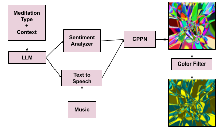

 &nbsp;
 &nbsp;
 &nbsp;  
 &nbsp;
 &nbsp;

<!--  &nbsp; -->
<!--  -->

# meditation_induction_ai
Clone the repo  
`git clone https://github.com/petern48/meditation_induction_ai.git`  
Change directory  
`cd meditation_induction_ai`

#### Install packages
Install the dependencies:  
`pipenv install`  
Activate the Python virtual environment:  
`pipenv shell`

Activating the virtual environment allows you to work within an isolated environment where the dependencies you installed with pipenv install are available. This ensures that your project uses the correct versions of packages and avoids conflicts with system-wide packages.

Also, it is necessary to install:  
`sudo apt install ffmpeg`  
`pipenv run python -m nltk.downloader punkt vader_lexicon`

### Program overview
Generate a meditation video with speech (and optionally music) using AI models.
1. Text Generation: Generate a meditation script by specifying the desired type of meditation.
2. Text to Speech: Create speech for the text and (optionally add music) to it.
3. Video Generation: Generate relaxing visuals by inputting audio into a Compositional Pattern Producing Network (CPPN)

Select a meditation type from the following list:  
`['mindful-observation', 'body-centered', 'visual-concentration', 'contemplation', 'affect-centered', 'mantra-meditation', 'movement-meditation']`

The program will generate a script for the meditation, feed that script to create audio, and feed that audio into the CPPN to generate a video. The video will come with the audio and (optional) music. 

### Run the program:
Produce a meditation by providing a *med_type* (see below)  
`python main.py --med_type [med_type]`
such as:
`python main.py --med_type mindful-observation`

By default, the background music will be added and cppn-based images will be generated unless you specify it as follows:
- Skip background music: `python main.py --med_type [med_type] --skip_background_music`
- Skip cppn-based image generation: `python main.py --med_type [med_type] --skip_cppn_generation`

Run the program while skipping the text generation
`python main.py --med_type [med_type] --script_file [text_file]`

Afterwards, the resulting folder `output` will contain the script and video.

### Command Line Options

- `--med_type` _[required]_ select the med_type  
Options: ['mindful-observation', 'body-centered', 'visual-concentration', 'contemplation', 'affect-centered', 'mantra-meditation', 'movement-meditation']

- `--fps` [optional] select the frames per second the resulting video will be (more fps means more time to generate).  
Default: 20

- `--script_file` [optional] input a file path to a text file to skip text generation step

- `--accent` [optional] select an accent for the speech to be spoken in  
Default: indian, co.in   
Options: ['com.au', 'co.uk', 'us', 'ca', 'co.in', 'ie', 'co.za']

- `--music_file` [optional] specify a audio file path to use for background music  
Default: use the provided music file

- `--channels` [optional] number of channels. 3 will use RGB, 1 will use black/white  
Default: 3

- `--x_dim` [optional] Specify the x size of images  
Default: 256

- `--y_dim` [optional] Specify the y size of images  
Default: 256

- `--color_scheme` [optional] Specify `cool` for a cool color scheme (good for relaxation) or `warm` for a warm color schem (good for energy and focus)  
Options: ['red-orange', 'blue-green', 'blue-yellow', 'black-white', 'warm', 'cool']

- `--show_ffmpeg_output` [optional] Do not suppress the output of the ffmpeg commands (useful if some sort of error happens)  

- `--skip_cppn_generation` [optional] Skips the video generation

- `--skip_background_music` [optional] Skip overlaying background music

### References
CPPN model based on https://github.com/neale/CPPN

Inspiration taken from the following articles:
https://nenadmarkus.com/p/visualizing-audio-with-cppns/  
https://blog.otoro.net/2016/03/25/generating-abstract-patterns-with-tensorflow/
